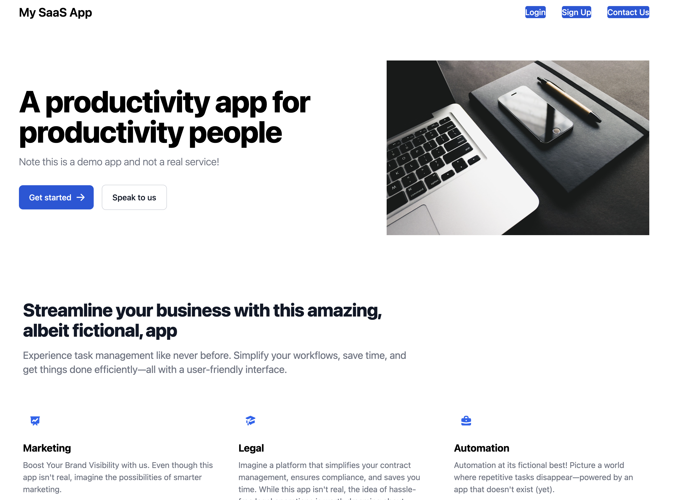
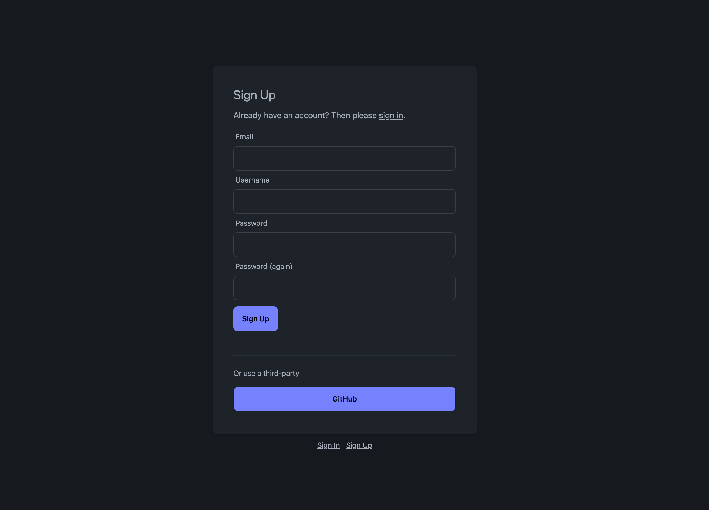
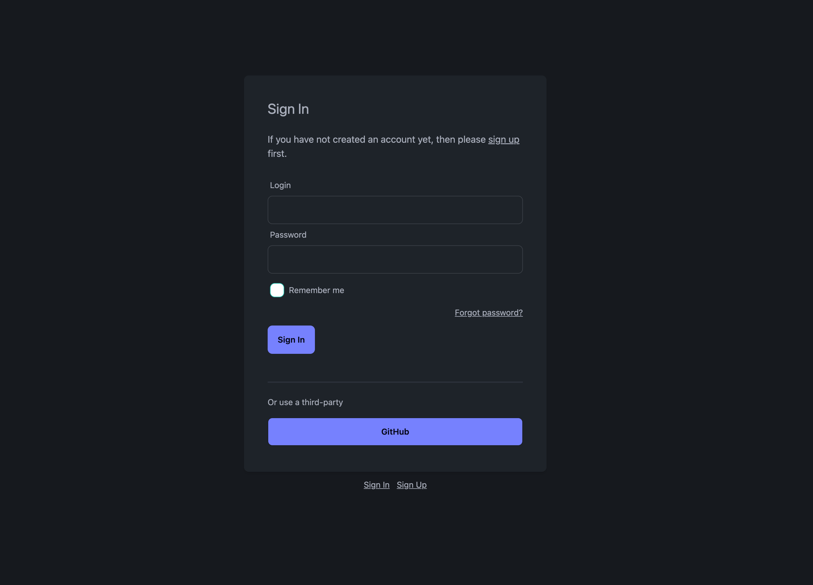
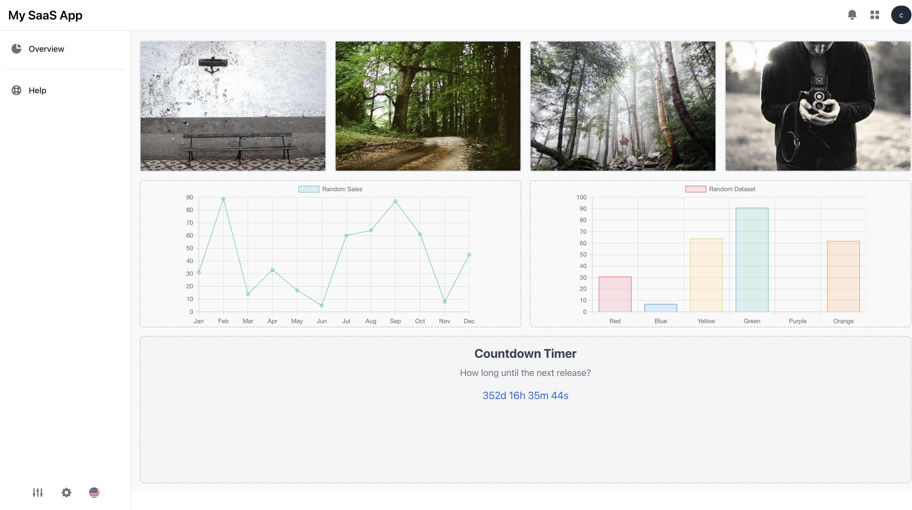
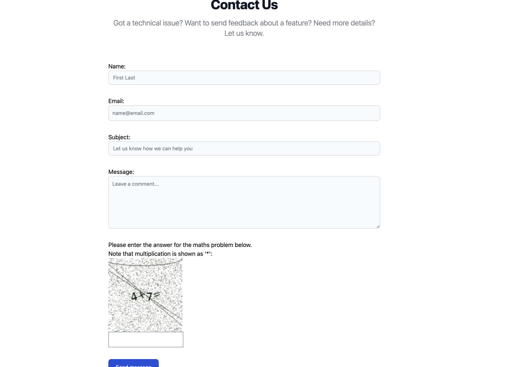
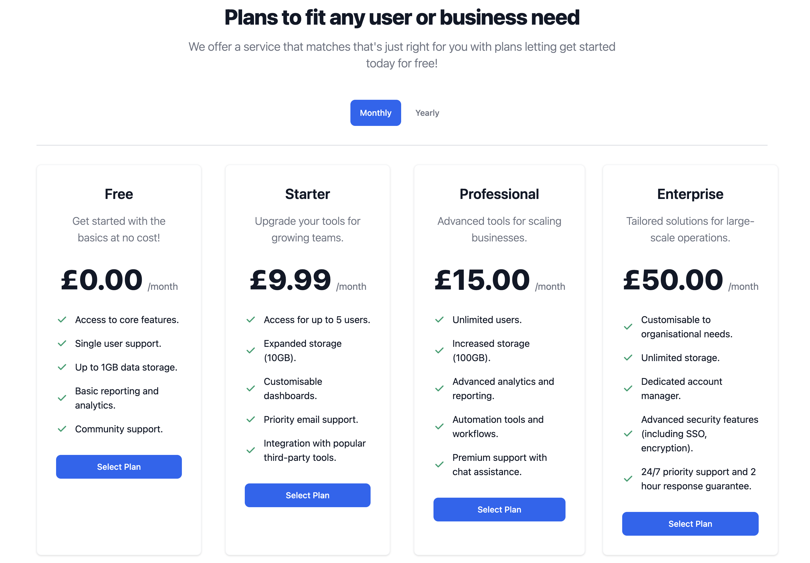
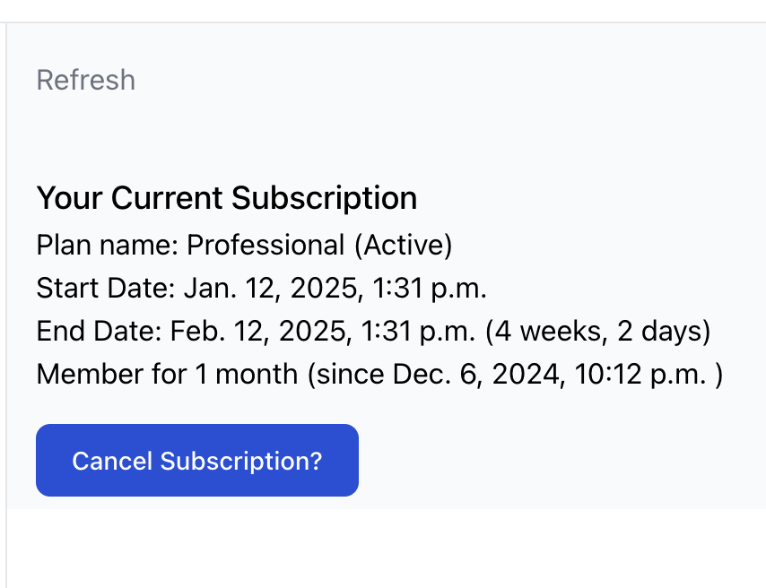

# SaaS App

A Software as a Service (SaaS) platform built using Django, Tailwind, Postgres, and more. It is hosted on Railway with integrated Stripe payment processing. The project serves as a reusable foundation for SaaS products, with customisations to suit unique requirements.

**Live Demo**: [Railway app](https://saas-app-production-1e09.up.railway.app/) 

## Features
- Secure Stripe Integration for payment processing.
- Scalable Architecture leveraging Django and Postgres.
- Responsive Design styled with Tailwind CSS.
- Customisable deployment through Docker or local setup.
- Customisations and Enhancements are details in the [Enhancements ReadMe](enhancements/README.md)


This project is inspired by the SaaS foundations course by [Coding for Entrepreneurs](https://github.com/codingforentrepreneurs/SaaS-Foundations) (CFE). While the course served as an excellent starting point, I extended and tailored the implementation to build a unique foundation for SaaS projects.

## Getting Started

### Clone
```bash
git clone https://github.com/Uokoroafor/saas-app.git
cd saas-app
```

### Configure .env file
- Create and configure `.env` with the following values:
    ```plaintext
    BASE_URL = "http://127.0.0.1:8000"
    DJANGO_DEBUG=True
    DJANGO_SECRET_KEY=""
    DATABASE_URL = ""
    EMAIL_HOST="smtp.gmail.com"
    EMAIL_PORT="587"
    EMAIL_USE_TLS=True
    EMAIL_USE_SSL=False
    EMAIL_HOST_USER=""
    EMAIL_HOST_PASSWORD=""
    ADMIN_USER_NAME=""
    ADMIN_USER_EMAIL=""
    DEFAULT_CURRENCY=""
    STRIPE_SECRET_KEY = ""
    ```

- Generate a `DJANGO_SECRET_KEY`:
    ```bash
    python -c 'from django.core.management.utils import get_random_secret_key; print(get_random_secret_key())'
    ```
Once you have this value, add update `DJANGO_SECRET_KEY` in the `.env` file.

### Running the app
There are two options for running - either via docker or a fully local implementation:
#### 1. Running via Docker
Make sure you have [Docker](https://docs.docker.com/engine/install/) is installed locally.
```bash
docker compose --env-file .env up
```
#### 2. Running Locally
- Install [Poetry](https://python-poetry.org/) for dependency management.
- Set up your environment:
    ```bash
    potry install
    poetry shell
    ```

- Setup the database, migration, superuser and vendor files:
    ```bash
    python manage.py migrate
    python manage.py createsuperuser
    python manage.py vendor_pull
    ```
#### Run the Server
```bash
python manage.py runserver
```


### Stripe Signup
1. Sign up on [Stripe.com](https://www.stripe.com)
2. Generate a Stripe Secret API Key and update the `.env` file under `STRIPE_SECRET_KEY`.

### Testing out with Stripe

To test the payment features of this project, you can use Stripe's [official test card details](https://docs.stripe.com/testing?testing-method=card-numbers). These cards work only in Stripe's test environment and are safe to use. 

**Please do NOT use any real card details!**

### Test Card Details

Here are some commonly used test cards:

| Card Type            | Card Number      | Expiry Date | CVC  |
|----------------------|------------------|-------------|------|
| Visa    | 4242 4242 4242 4242 | Any future date | Any 3 digits | 
| Masercard | 5555 5555 5555 4444 | Any future date | Any 3 digits |
| Visa (authentication required) | 3782 822463 10005 | Any future date | Any 4 digits |


#### Additional Notes

- Ensure the project is running in **Stripe's test environment** i.e. using a test stripe secret key. Test card details will not work in live mode.

## Acknowledgements
Inspired by [Coding for Entrepreneurs](https://github.com/codingforentrepreneurs/SaaS-Foundations)

This project used the following resources:

- **[Flowbite](https://flowbite.com/docs/getting-started/introduction/):** UI components and templates used to design the frontend.
- **[Lorem Picsum](https://picsum.photos/):** Placeholder images used for visual elements in the application.

Many thanks to the creators of these resources for making development faster and easier!

## Screenshots
**Landing Page**
<!--  -->


**Sign Up and Login**
<p float="left">


</p>

**Dashboard**



**Contact Us**



**Pricing**



**Subscription View**

